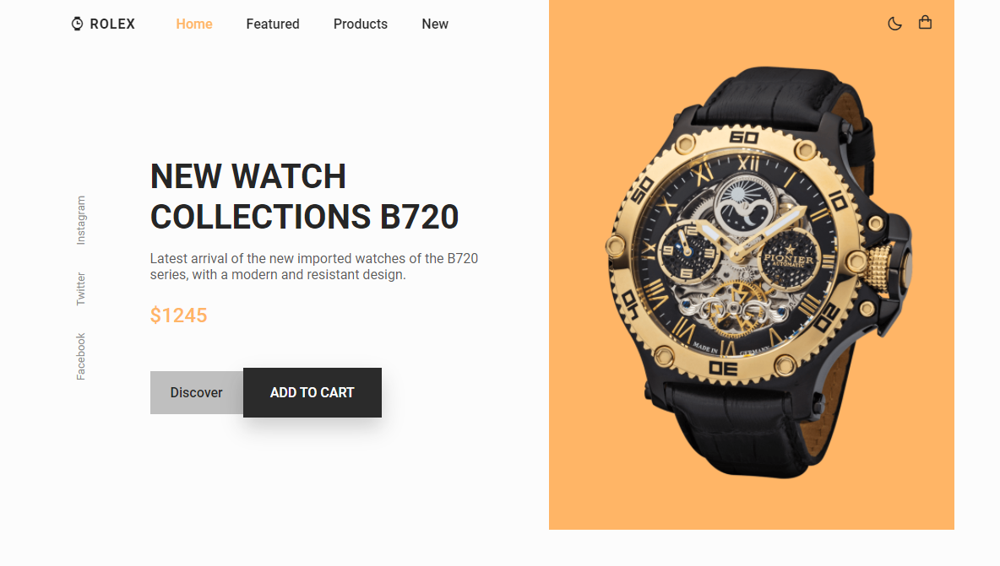
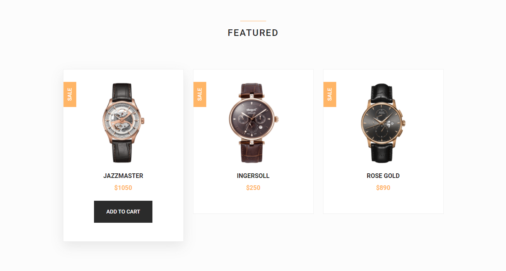
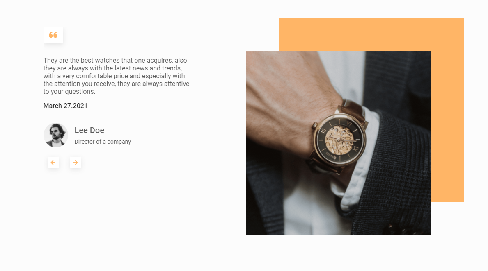

# Responsive Whatches website

Um site de venda de relógios TOTALMENTE responsivo e com várias funções

<ul>
  <li>Adaptado para vários tamanhos de despositivos usando HTML, CSS e JAVASCRIPT</li>
  <li>Menu com scroll suave entre as seções</li>
  <li>Menu interativo</li>
  <li>Cards de produtos interativos</li>
  <li>Troca entre temas claro e escuro</li>
  <li>Slides funcionais</li>
</ul>

Esse projeto foi desenvolvido via um tutorial no canal Bendicode.

All credits from this layout and code for [Bendicode](https://www.youtube.com/c/Bedimcode/featured)

Thanks [Bendicode](https://github.com/bedimcode)

# [Vizualize aqui](https://thiagofang.github.io/responsive-whatches-wesite/)

